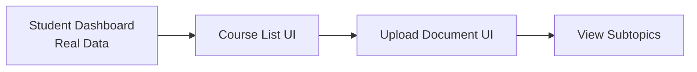
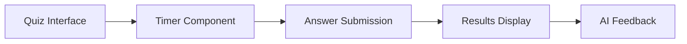
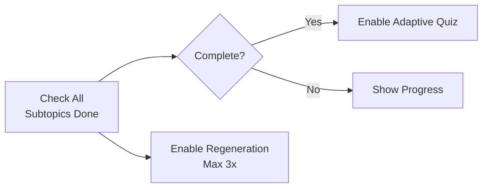

# SumakQuiz Gap Analysis Report
## Alignment with Capstone Requirements

**Generated:** 2025-10-11  
**Project:** SumakQuiz - AI-Powered Study Platform  
**Tech Stack:** Laravel 11 + Livewire 3

---

## Executive Summary

Based on comprehensive analysis of the capstone document and current codebase, the SumakQuiz implementation has **strong backend foundations** but is **missing critical student-facing interfaces and workflows**. The backend API, database schema, and AI integration are well-implemented, but the platform lacks the user interfaces needed for students to interact with the system as described in the capstone.

### Implementation Status: **~60% Complete**

- ✅ **Database Schema:** 95% complete
- ✅ **AI Integration:** 90% complete  
- ✅ **Admin Panel:** 100% complete (Filament)
- ⚠️ **Backend API:** 70% complete (missing quiz workflow endpoints)
- ❌ **Student UI:** 15% complete (only dashboard mock)
- ❌ **Quiz Taking Interface:** 0% complete
- ❌ **Quiz Regeneration Flow:** 0% complete
- ⚠️ **Adaptive Quiz Workflow:** 40% complete

---

## 1. CRITICAL GAPS (Priority 1 - Must Implement)

### 1.1 Student Quiz Taking Interface ❌
**Capstone Requirement:** Figures 9-12 show quiz taking interface with timer, questions, options

**Missing Components:**
- [ ] Student quiz interface (Livewire component)
- [ ] 60-second countdown timer per question
- [ ] Question display with 4 options (A, B, C, D)
- [ ] Visual timer indicators (green→yellow→red)
- [ ] Answer submission and immediate feedback
- [ ] Progress tracking during quiz
- [ ] Quiz completion screen with results

**Current State:** ❌ No implementation  
**Files Needed:**
- `app/Livewire/TakeQuiz.php`
- `resources/views/livewire/take-quiz.blade.php`
- `resources/views/livewire/quiz-result.blade.php`

---

### 1.2 Student Course Management Interface ❌
**Capstone Requirement:** Figures 5-8 show course/document upload workflow

**Missing Components:**
- [ ] Course creation form (Figure 6)
- [ ] Course listing page (Figure 5, 7)
- [ ] Document upload interface (Figure 8, 9)
- [ ] Lecture quiz generation UI
- [ ] Subtopic quiz collection view (Figure 11)
- [ ] Manual OBTL input form (when no file uploaded)

**Current State:** ❌ API endpoints exist, no UI  
**Files Needed:**
- `app/Livewire/StudentCourses.php`
- `app/Livewire/CourseDetail.php`
- `app/Livewire/UploadLecture.php`
- `resources/views/livewire/student-courses.blade.php`
- `resources/views/livewire/course-detail.blade.php`

---

### 1.3 Quiz Regeneration Workflow ❌
**Capstone Requirement:** Section 1.3 - "Up to 3 regenerations with reworded questions"

**Missing Components:**
- [ ] Check if initial quizzes completed before allowing regeneration
- [ ] Regeneration button UI (max 3 times per subtopic)
- [ ] Track regeneration count per subtopic per user
- [ ] API endpoint to trigger regeneration
- [ ] Connect to existing reword logic in [`OpenAiService::rewordQuestion()`](app/Services/OpenAiService.php:115)

**Current State:** ⚠️ Backend logic exists, no workflow  
**Backend Logic Available:**
- ✅ [`OpenAiService::rewordQuestion()`](app/Services/OpenAiService.php:115) - AI reword logic
- ✅ [`QuizRegeneration`](app/Models/QuizRegeneration.php:1) model exists
- ❌ No controller/endpoint to orchestrate flow
- ❌ No UI to trigger regeneration

**Files to Create:**
- `app/Http/Controllers/QuizRegenerationController.php`
- Update `app/Livewire/CourseDetail.php` to show regeneration buttons

---

### 1.4 Adaptive Quiz Generation After Initial Completion ❌
**Capstone Requirement:** Section 1.2 - "After completing all subtopic quizzes, generate adaptive quiz using 1PL IRT"

**Missing Components:**
- [ ] Check when ALL subtopic quizzes are completed
- [ ] Automatically trigger adaptive quiz generation
- [ ] Use [`IrtService::selectAdaptiveItems()`](app/Services/IrtService.php:157) to select questions
- [ ] Mark quiz as "adaptive" vs "initial"
- [ ] Prevent adaptive quiz before all initials complete

**Current State:** ⚠️ IRT logic exists, no orchestration  
**Backend Available:**
- ✅ [`IrtService`](app/Services/IrtService.php:12) - Complete 1PL implementation
- ✅ [`StudentAbility`](app/Models/StudentAbility.php:12) model tracks theta
- ❌ No workflow to trigger adaptive generation
- ❌ [`QuizController::start()`](app/Http/Controllers/QuizController.php:26) needs adaptive flag logic

**Implementation Needed:**
```php
// Check if student completed all initial subtopic quizzes
if ($subtopic->hasCompletedAllInitialQuizzes($userId)) {
    // Generate adaptive quiz based on theta
    $studentAbility = StudentAbility::where(...)->first();
    $adaptiveQuestions = $irtService->selectAdaptiveItems(
        $studentAbility->theta, 
        $availableItems, 
        20
    );
}
```

---

### 1.5 Real Dashboard Data Integration ❌
**Capstone Requirement:** Section 1.3, Figure 4 - Performance dashboard with analytics

**Missing Components:**
- [ ] Replace mock data in [`StudentDashboard`](app/Livewire/StudentDashboard.php:28) with real data
- [ ] Connect to [`StudentDashboardController::getDashboardData()`](app/Http/Controllers/Student/StudentDashboardController.php:24)
- [ ] Display actual course progress
- [ ] Show real quiz attempts and scores
- [ ] Display actual AI feedback (not mock)
- [ ] Visualize theta/ability levels per subtopic

**Current State:** ❌ Mock data only  
**Controller Ready:** ✅ [`StudentDashboardController`](app/Http/Controllers/Student/StudentDashboardController.php:15) has real implementation  
**Livewire Component:** ❌ Using hardcoded mock data (lines 36-141)

**Fix Required:**
```php
// In app/Livewire/StudentDashboard.php
public function loadDashboardData() {
    $data = $this->dashboardController->getDashboardData();
    $this->courses = $data['courses'];
    $this->recentQuizzes = $data['recent_quizzes'];
    $this->aiFeedback = $data['ai_feedback'];
    $this->overallStats = $data['overall_stats'];
}
```

---

## 2. IMPORTANT GAPS (Priority 2 - Should Implement)

### 2.1 Student Authentication Flow ⚠️
**Current:** Generic auth, no student-specific registration  
**Needed:**
- [ ] Student registration with role selection
- [ ] Student ID field in registration
- [ ] Email verification (optional)
- [ ] Password reset flow for students

**Files to Review:**
- [`CreateNewUser`](app/Actions/Fortify/CreateNewUser.php:1) - Add student role
- Update registration view

---

### 2.2 Quiz Results & Feedback Display ⚠️
**Capstone Requirement:** Section 1.2 - AI-powered feedback per quiz

**Partially Implemented:**
- ✅ [`GenerateFeedbackJob`](app/Jobs/GenerateFeedbackJob.php:16) - Background job exists
- ✅ [`FeedbackGenerationController`](app/Http/Controllers/OpenAi/FeedbackGenerationController.php:12) - API ready
- ❌ No UI to display feedback to students
- ❌ Not automatically triggered after quiz completion

**Files Needed:**
- Update quiz result view to show AI feedback
- Trigger feedback generation in [`QuizController::complete()`](app/Http/Controllers/QuizController.php:137)

---

### 2.3 Table of Specification (ToS) Display ⚠️
**Capstone Requirement:** Section 1.3 - "Students can view ToS"

**Current State:**
- ✅ ToS generation works via [`TosGenerationController`](app/Http/Controllers/OpenAi/TosGenerationController.php:1)
- ✅ [`TableOfSpecification`](app/Models/TableOfSpecification.php:1) model complete
- ❌ No student UI to view ToS

**Files Needed:**
- Add ToS display in course detail view
- Show items per subtopic, cognitive levels, weights

---

### 2.4 Progress Tracking Visualization ⚠️
**Capstone Requirement:** Figure 4 - Dashboard with mastery levels

**Partially Implemented:**
- ✅ Backend calculates mastery (see [`StudentDashboardController::getCourseProgress()`](app/Http/Controllers/Student/StudentDashboardController.php:45))
- ⚠️ Dashboard shows mock data
- ❌ No subtopic-level progress bars
- ❌ No theta visualization per subtopic

**Enhancement Needed:**
- Add progress bars per subtopic
- Color-code by proficiency level (Beginner→Advanced)
- Show estimated ability (θ) values

---

## 3. MINOR GAPS (Priority 3 - Nice to Have)

### 3.1 Quiz History & Review ⚠️
**Needed:**
- [ ] List all past quiz attempts
- [ ] Review previous answers
- [ ] Compare attempts (1st vs 2nd vs 3rd)

---

### 3.2 Mobile Responsiveness ⚠️
**Current:** Dashboard has some responsive design  
**Needed:** Ensure quiz interface works on mobile (per Table 6 in capstone)

---

### 3.3 Export/Download Features ⚠️
**Potential Features:**
- Download ToS as PDF
- Export quiz results
- Download performance report

---

## 4. BACKEND COMPLETENESS ANALYSIS

### ✅ Fully Implemented
1. **Database Schema** - All tables from ERD (Figure 14) exist:
   - ✅ users, courses, obtl_documents, learning_outcomes, sub_outcomes
   - ✅ documents, topics, subtopics
   - ✅ table_of_specifications, tos_items
   - ✅ item_bank, quiz_attempts, responses
   - ✅ student_abilities, feedback, quiz_regenerations

2. **AI Integration**:
   - ✅ [`OpenAiService`](app/Services/OpenAiService.php:16) - Complete with all methods
   - ✅ Content analysis, ToS generation, quiz generation
   - ✅ Question reword, feedback generation
   - ✅ OBTL parsing

3. **IRT Implementation**:
   - ✅ [`IrtService`](app/Services/IrtService.php:12) - Full 1PL Rasch model
   - ✅ Ability estimation, probability calculation
   - ✅ Adaptive item selection
   - ✅ Proficiency levels

4. **Admin Panel**:
   - ✅ Full Filament admin for all models
   - ✅ API usage tracking
   - ✅ Cost monitoring

### ⚠️ Partially Implemented
1. **Quiz Workflow**:
   - ✅ [`QuizController`](app/Http/Controllers/QuizController.php:14) has start, submit, complete
   - ❌ No student UI to use these endpoints
   - ❌ Adaptive quiz flag not properly used

2. **Course/Document Management**:
   - ✅ [`CourseController`](app/Http/Controllers/CourseController.php:12), [`DocumentController`](app/Http/Controllers/DocumentController.php:13)
   - ❌ No student-facing upload interface

### ❌ Not Implemented
1. **Student Frontend** - 95% missing
2. **Quiz Regeneration Workflow** - 0% complete
3. **Adaptive Quiz Trigger** - 0% complete

---

## 5. IMPLEMENTATION PRIORITY MATRIX

### 🔴 Critical (Week 1-2)
**Impact: High | Effort: High | Required: Yes**

1. **Student Quiz Taking Interface** 
   - Effort: 3-4 days
   - Files: 5-6 new components
   - **Blocker for:** Core functionality

2. **Course & Document Upload UI**
   - Effort: 2-3 days  
   - Files: 3-4 components
   - **Blocker for:** Content upload

3. **Real Dashboard Integration**
   - Effort: 1 day
   - Files: 1 component update
   - **Quick Win**

### 🟡 Important (Week 3)
**Impact: High | Effort: Medium | Required: Yes**

4. **Quiz Regeneration Workflow**
   - Effort: 2 days
   - Dependencies: Quiz interface complete

5. **Adaptive Quiz Generation**
   - Effort: 2 days
   - Dependencies: Initial quiz flow working

6. **Feedback Display**
   - Effort: 1 day
   - Enhancement to quiz results

### 🟢 Enhancement (Week 4)
**Impact: Medium | Effort: Low-Medium | Required: Nice to have**

7. **ToS Viewer**
8. **Quiz History**
9. **Mobile Polish**
10. **Export Features**

---

## 6. RECOMMENDED IMPLEMENTATION ORDER

### Phase 1: Core Student Experience (Week 1)


**Tasks:**
1. Fix dashboard mock data → real data
2. Create course listing Livewire component
3. Create document upload component
4. Display subtopics per lecture

**Deliverable:** Students can upload content and see courses

---

### Phase 2: Quiz Taking (Week 2)


**Tasks:**
1. Create quiz taking Livewire component
2. Implement 60-second timer with color changes
3. Wire up answer submission to [`QuizController::submitAnswer()`](app/Http/Controllers/QuizController.php:103)
4. Display results and trigger feedback generation
5. Show AI feedback on results page

**Deliverable:** Students can take quizzes end-to-end

---

### Phase 3: Advanced Features (Week 3)


**Tasks:**
1. Implement "all subtopics complete" check
2. Add adaptive quiz generation workflow
3. Create regeneration UI and workflow
4. Connect to [`OpenAiService::rewordQuestion()`](app/Services/OpenAiService.php:115)

**Deliverable:** Adaptive quizzes and regeneration working

---

### Phase 4: Polish & Testing (Week 4)
**Tasks:**
1. Add ToS viewer
2. Implement quiz history
3. Mobile responsive testing
4. User acceptance testing
5. Bug fixes and optimizations

**Deliverable:** Production-ready platform

---

## 7. KEY FILES TO CREATE

### New Controllers Needed:
```
app/Http/Controllers/Student/
├── QuizRegenerationController.php    # NEW - Handle regeneration
├── QuizHistoryController.php          # NEW - Quiz history
└── TosViewController.php              # NEW - Display ToS
```

### New Livewire Components Needed:
```
app/Livewire/
├── StudentCourses.php                 # NEW - Course listing
├── CourseDetail.php                   # NEW - Course detail with subtopics
├── UploadLecture.php                  # NEW - Document upload
├── TakeQuiz.php                       # NEW - Quiz interface (CRITICAL)
├── QuizResult.php                     # NEW - Results display
├── QuizHistory.php                    # NEW - Past attempts
└── TosViewer.php                      # NEW - View ToS
```

### New Views Needed:
```
resources/views/livewire/
├── student-courses.blade.php
├── course-detail.blade.php
├── upload-lecture.blade.php
├── take-quiz.blade.php               # CRITICAL
├── quiz-result.blade.php
├── quiz-history.blade.php
└── tos-viewer.blade.php
```

### Routes to Add:
```php
// Add to routes/web.php under student prefix
Route::middleware(['auth', 'student'])->prefix('student')->group(function () {
    Route::get('/courses', StudentCourses::class)->name('student.courses');
    Route::get('/course/{course}', CourseDetail::class)->name('student.course.show');
    Route::get('/quiz/{subtopic}', TakeQuiz::class)->name('student.quiz.take');
    Route::get('/quiz/{attempt}/result', QuizResult::class)->name('student.quiz.result');
    Route::post('/quiz/{subtopic}/regenerate', [QuizRegenerationController::class, 'regenerate']);
});
```

---

## 8. DATABASE SCHEMA GAPS

### ✅ Complete Tables:
All tables from capstone ERD (Figure 14) exist with proper relationships

### ⚠️ Minor Adjustments Needed:

**quiz_attempts table:**
```php
// Add field to track if adaptive
Schema::table('quiz_attempts', function (Blueprint $table) {
    $table->boolean('is_adaptive')->default(false)->after('attempt_number');
});
```

**quiz_regenerations table:**
```php
// Add user_id to track who regenerated
Schema::table('quiz_regenerations', function (Blueprint $table) {
    $table->foreignId('user_id')->nullable()->after('subtopic_id');
});
```

---

## 9. API ENDPOINTS STATUS

### ✅ Implemented & Working:
- `POST /api/courses` - Create course
- `GET /api/courses/{course}` - Get course  
- `POST /api/documents` - Upload document
- `GET /api/documents/{document}/status` - Processing status
- `POST /api/quiz/{subtopic}/start` - Start quiz
- `POST /api/quiz/{attempt}/answer` - Submit answer
- `POST /api/quiz/{attempt}/complete` - Complete quiz
- `GET /api/quiz/{attempt}/results` - Get results
- `POST /api/openai/feedback/generate` - Generate feedback
- `GET /api/dashboard` - Dashboard data

### ❌ Missing Endpoints:
- `POST /api/quiz/{subtopic}/regenerate` - Trigger regeneration
- `GET /api/quiz/history` - Quiz history
- `GET /api/tos/{document}` - View ToS
- `GET /api/subtopics/{subtopic}/status` - Check completion

---

## 10. TESTING GAPS

### ✅ Existing Tests:
- `tests/Unit/Services/OpenAiServiceTest.php` - AI service tests

### ❌ Missing Tests:
- Quiz workflow integration tests
- IRT calculation tests  
- Regeneration flow tests
- Adaptive quiz selection tests
- Student ability estimation tests

---

## 11. DOCUMENTATION GAPS

### ✅ Existing:
- Capstone document (comprehensive)
- API examples in [`OpenAiServiceExamples`](app/Services/Examples/OpenAiServiceExamples.php:1)

### ❌ Missing:
- Student user guide
- API documentation
- Deployment guide
- Developer setup guide

---

## 12. IMMEDIATE ACTION ITEMS

### This Week:
1. ✅ **You are here** - Gap analysis complete
2. **Create** [`TakeQuiz.php`](app/Livewire/TakeQuiz.php:1) Livewire component
3. **Create** quiz interface view with timer
4. **Test** quiz taking end-to-end
5. **Fix** dashboard mock data

### Next Week:
6. **Implement** regeneration workflow
7. **Add** adaptive quiz trigger logic
8. **Create** course management UI
9. **Test** complete student flow

---

## 13. RISK ASSESSMENT

### 🔴 High Risk:
- **Quiz interface complexity** - Timer + real-time updates challenging in Livewire
  - *Mitigation:* Use Alpine.js for timer, websockets if needed

### 🟡 Medium Risk:
- **Adaptive quiz logic** - Complex IRT calculations
  - *Mitigation:* IRT service already complete, just need workflow

### 🟢 Low Risk:
- **UI components** - Standard Livewire patterns
- **API integration** - Backends ready

---

## 14. RESOURCE REQUIREMENTS

### Development Time:
- **Phase 1 (Core):** 1 week (40 hours)
- **Phase 2 (Quiz):** 1 week (40 hours)
- **Phase 3 (Advanced):** 1 week (40 hours)
- **Phase 4 (Polish):** 1 week (40 hours)
- **Total:** 4 weeks (160 hours)

### Team:
- 1 Full-stack developer (Laravel + Livewire)
- 1 Frontend developer (UI/UX polish) - Part-time
- 1 QA tester - Final week

---

## 15. SUCCESS CRITERIA

### Minimum Viable Product (MVP):
- [x] Students can register/login
- [ ] Students can create courses
- [ ] Students can upload lectures (PDF)
- [ ] Students can upload/input OBTL
- [ ] ToS auto-generates per lecture
- [ ] Students can take 20-question quizzes per subtopic
- [ ] 60-second timer per question
- [ ] Immediate feedback (correct/incorrect)
- [ ] Score calculation
- [ ] AI feedback after quiz
- [ ] Dashboard shows real progress
- [ ] Ability (θ) calculated using 1PL IRT

### Full Feature Set:
- [ ] All MVP features ✓
- [ ] Quiz regeneration (up to 3x) with reworded questions
- [ ] Adaptive quizzes after all subtopics complete
- [ ] Subtopic mastery tracking
- [ ] Quiz history
- [ ] ToS viewer
- [ ] Mobile responsive

---

## 16. CONCLUSION

**Current Status:** Strong backend, minimal frontend

**Critical Path:**
1. Quiz taking interface (1 week)
2. Course/document upload UI (3 days)
3. Dashboard real data (1 day)
4. Regeneration workflow (2 days)
5. Adaptive quiz trigger (2 days)

**Timeline:** 4 weeks to production-ready  
**Biggest Challenge:** Quiz interface with real-time timer  
**Biggest Asset:** Complete backend + AI integration already done

**Recommendation:** Focus on **Phase 1-2 first** (quiz taking), as this is the core user experience. All backend infrastructure is ready - we just need to expose it through student-facing UI.

---

## Appendix: Quick Reference

### Key Backend Files (Already Implemented):
- [`OpenAiService.php`](app/Services/OpenAiService.php:16) - AI integration ✅
- [`IrtService.php`](app/Services/IrtService.php:12) - 1PL IRT model ✅
- [`QuizController.php`](app/Http/Controllers/QuizController.php:14) - Quiz API ✅
- [`StudentDashboardController.php`](app/Http/Controllers/Student/StudentDashboardController.php:15) - Dashboard data ✅

### Key Frontend Files (Need to Create):
- `app/Livewire/TakeQuiz.php` - **CRITICAL** ❌
- `app/Livewire/StudentCourses.php` - **CRITICAL** ❌
- `app/Livewire/CourseDetail.php` - **CRITICAL** ❌

### Next Steps Document:
See `IMPLEMENTATION_PLAN.md` for detailed step-by-step instructions.